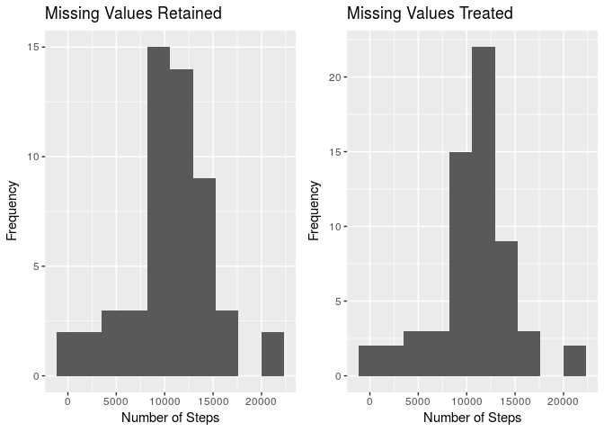

### Alexander Villasoto
### November 6, 2018

## Loading and preprocessing the data

```r
# load dependencies
library(dplyr)
library(ggplot2)
library(xtable)
library(tidyr)
library(gridExtra)
# load the dataset 
data.with.na <- read.csv(unz("./activity.zip", "activity.csv"), header=TRUE, 
                         quote="\"", sep=",")
```

## What is mean total number of steps taken per day?

```r
# group data by date and sum the number of steps per day
num.of.steps.per.day <- data.with.na %>% 
  group_by(date) %>% 
  summarise(number.of.steps = sum(steps))
# generate plot
plot.with.na <- ggplot(num.of.steps.per.day) + 
  geom_histogram(aes(x = number.of.steps), bins = 10) + 
  xlab("Number of Steps") + 
  ylab("Frequency")
plot.with.na + 
  ggtitle("Histogram of the Number of Steps Recorded Per Day")
```

```
## Warning: Removed 8 rows containing non-finite values (stat_bin).
```

<!-- -->

```r
# Calculate and report the mean and median of the total number of steps taken 
# per day
centers <- num.of.steps.per.day %>% 
  summarise(mean.steps = mean(number.of.steps, na.rm = TRUE), 
            median.steps = median(number.of.steps, na.rm = TRUE))
data.frame(centers)
```

```
##   mean.steps median.steps
## 1   10766.19        10765
```

As you can see, both the measures of centrality are close to each other with mean 10766 and median 10765.

## What is the average daily activity pattern?

```r
# time series plot of the 5-minute interval and the number of steps taken, 
# averaged across all days
# first, we group by the interval and get the mean for each interval using
# the summarise function. We easily achieve this through dplyr chaining.
num.of.steps.per.interval <- data.with.na %>% 
  group_by(interval) %>% 
  summarise(average.steps = mean(steps, na.rm=TRUE))
# plot the time series plot (achieved by using ggplot2's geom_line()).
ggplot(num.of.steps.per.interval, aes(x = interval, y = average.steps)) + 
  geom_line()
```

<!-- -->

```r
# Question: Which 5-minute interval, on average across all the days in the 
# dataset, contains the maximum number of steps?
data.frame((data.with.na %>% 
              group_by(interval) %>% 
              summarise(average.steps = mean(steps, na.rm=TRUE)) %>% 
              arrange(desc(average.steps)))[1, 1:2])
```

```
##   interval average.steps
## 1      835      206.1698
```

We achieve the highest mean steps of 206.1698 at the 5-minute step interval 835

## Imputing missing values

```r
# Calculate and report the total number of missing values in the dataset
# see the first 6 rows of data
head(data.with.na)
```

```
##   steps       date interval
## 1    NA 2012-10-01        0
## 2    NA 2012-10-01        5
## 3    NA 2012-10-01       10
## 4    NA 2012-10-01       15
## 5    NA 2012-10-01       20
## 6    NA 2012-10-01       25
```

```r
# Count of NAs in the dataset
summary(data.with.na)[7, 1]
```

```
## [1] "NA's   :2304  "
```

```r
# replace missing values with mean for that 5-minute interval
# Not a very optimal solution I think, but it does the job. :)

# This function returns the average steps given an interval.
# We previously computed this and saved in variable num.of.steps.per.interval
returnAverageByInterval <- function(interval) {
  average.steps <- data.frame(num.of.steps.per.interval[num.of.steps.per.interval$interval == interval, "average.steps"])
  average.steps
}
# reassign the variable to retain the previous one
data.with.nas.treated = data.with.na
# calls the function returnAverageByInterval above per encounter of NAs in
# the loop. Each return value will be assigned to the NA variable
for(i in 1:dim(data.with.nas.treated)[1]) {
  if(is.na(data.with.nas.treated[i, "steps"])) {
    data.with.nas.treated[i, "steps"] <- returnAverageByInterval(data.with.nas.treated[i, "interval"])
  }
}
# group data by date and sum the number of steps per day (for dataset with missing values treated)
num.of.steps.per.day.treated <- data.with.nas.treated %>% 
  group_by(date) %>% 
  summarise(number.of.steps = sum(steps, na.rm = TRUE))
# generate plot (for dataset with missing values treated)
plot.cleaned <- ggplot(num.of.steps.per.day.treated) + 
  geom_histogram(aes(x = number.of.steps), bins = 10) + 
  xlab("Number of Steps") + 
  ylab("Frequency") + 
  ggtitle("Missing Values Treated")
# Compare the previously generated plot to the outstanding plot side by side
plot1 <- plot.with.na +
  ggtitle("Missing Values Retained")
grid.arrange(plot1, plot.cleaned, ncol=2)
```

```
## Warning: Removed 8 rows containing non-finite values (stat_bin).
```

<!-- -->

```r
# Calculate and report the mean and median of the total number of steps taken 
# per day ()
centers.treated <- num.of.steps.per.day.treated %>% 
  summarise(mean.steps = mean(number.of.steps), 
            median.steps = median(number.of.steps))
# Do these values differ from the estimates from the first part of the assignment?
rbind("data with nas" = data.frame(centers), "data with nas treated" = data.frame(centers.treated))
```

```
##                       mean.steps median.steps
## data with nas           10766.19     10765.00
## data with nas treated   10766.19     10766.19
```

```r
# What is the impact of imputing missing data on the estimates of the total daily number of steps?
```

As you can see, there is no significant change in the measures of centrality when we impute the data. In fact, the mean and medians became equal when NAs are treated. 

## Are there differences in activity patterns between weekdays and weekends?

```r
# Using our treated data, we now generate another version of it where we 
# add another variable that separates weekdays from weekends to compare their
# time series plot by ggplot faceting. 
weekday.string <- c("Monday", "Tuesday", "Wednesday", "Thursday", "Friday")
data.with.weekday.factor <- data.with.nas.treated %>%
  mutate(weekday = weekdays(as.Date(date)),
         is.weekday = factor(ifelse(weekday %in% weekday.string, TRUE, FALSE),
                             levels = c(TRUE, FALSE), 
                             labels = c("Weekday", "Weekend")))
# We now calculate the mean steps after grouping by is.weekday and interval in
# that order. 
data.with.weekday.factor <- data.with.weekday.factor %>% 
  group_by(is.weekday, interval) %>%
  summarise(average.steps = mean(steps))
# We can easily condition our average steps as a function of interval by 
# is.weekday factor variable we just created before using the facet_grid 
# function of the ggplot2 package.
ggplot(data.with.weekday.factor, aes(x = interval, y = average.steps)) + 
  geom_line() + 
  facet_grid(is.weekday ~ .)
```

<!-- -->

Summary: Looking at the comparison of two groups, activities on weekdays are more concentrated on 550-1000 intervals (roughly 8:00 - 9:00 am) but are more spread on weekends. Still, most activities regardless of the day are  concentrated on the said interval.
